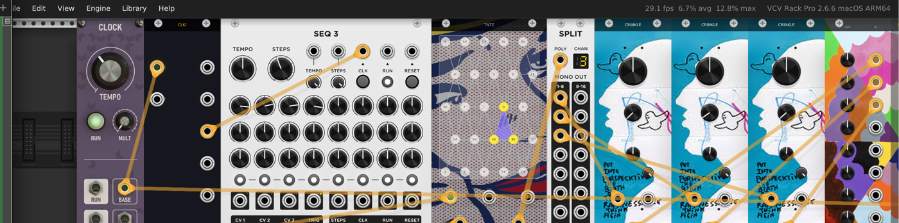

# vcv-rack

[VCV Rack](https://vcvrack.com/) is an open-source virtual modular synthesizer.
You patch together modules (oscillators, filters, sequencers, effects) with
virtual cables, the same way you would with hardware Eurorack.

This project builds patches with code instead of by hand. It has four main layers:

- **AgentRack** -- a custom C++ plugin with 13 modules (oscillators, filters,
  reverb, a Tonnetz chord generator, a dub delay, and more)
- **vcvpatch** -- a Python library that writes `.vcv` patch files
  programmatically and proves they are correctly wired before you open them
- **agent** -- an autonomous agent (Google ADK) that takes a musical description
  and produces a finished patch with no human in the loop
- **examples** -- runnable builder demos and small utilities showing the intended
  authoring surface


*A Basic Channel-style dub techno patch: clock, sequencer, Tonnetz chord
generator, three Crinkle wavefolder oscillators, Ladder filter, and Saphire
convolution reverb.*

https://github.com/tnn1t1s/vcv-rack/raw/main/tests/videos/dub_cm_demo_sm.mp4

## Repository layout

```
plugin/AgentRack/     C++ plugin: 14 modules, ~5200 lines
vcvpatch/             Python patch builder + signal graph prover, ~4000 lines
agent/                Agent workflows, tools, and persona configs (Google ADK)
examples/             Runnable PatchBuilder demos and small patch utilities
patches/              Patch recipes, generated `.vcv` outputs, and archived corpora
tests/                Pytest suites, integration tests, and patch fixtures
docs/                 Architecture docs, module references, pattern guides
evals/                Agent evaluation harness
```

## AgentRack plugin

13 modules covering oscillators, filters, effects, utilities, and sequencing.
Each module is a single `.cpp` file in `plugin/AgentRack/src/`.

| Module | HP | What it does |
|--------|----|-------------|
| **Attenuate** | 8 | 6-channel CV/audio attenuator. OUT = IN x SCALE. |
| **ADSR** | 8 | Envelope generator with per-stage CV modulation. |
| **Cassette** | 8 | Tape loop player. 4 presets, 3 tape quality modes, variable speed. |
| **Crinkle** | 8 | Buchla 259-style wavefolder oscillator. 5-stage fold, 4x oversampled. |
| **Ladder** | 6 | TB-303-lineage Huovilainen nonlinear ladder filter. SPREAD/SHAPE pole topology. |
| **Noise** | 8 | Six spectral noise generators: white, pink, brown, blue, violet, crackle. |
| **Saphire** | 8 | Fixed-IR convolution reverb (Lex Hall). Overlap-save FFT, TIME/BEND/TONE/PRE. |
| **Sonic** | 8 | BBE-style spectral-phase maximizer. 3-band phase alignment + spectral tilt. |
| **Steel** | 8 | AI-driven wavetable stacker. Sidechain FFT feeds Gemma inference for 16 wavetable weights. |
| **BusCrush** | 12 | 8-channel summing bus with Mackie-style overload. Asymmetric rail clipping, 8x oversampled. |
| **ClockDiv** | 8 | Clock divider: /2, /4, /8, /16, /32 outputs. |
| **Tonnetz** | 12 | Trigger-addressed Tonnetz chord generator. 5x5 lattice, 32 triangles, voice-led triads. |
| **Maurizio** | 6 | Clock-syncable dub delay. Dotted/triplet/straight ratio, HP-filtered feedback, tape saturation. |

Build and install:

```bash
make -C plugin/AgentRack -j4
make -C plugin/AgentRack install
```

Design principles are documented in `plugin/AgentRack/DESIGN_PRINCIPLES.md`.
Key rules: normalize audio at boundaries (DSP in -1..1), constant-power
crossfade for mix controls, never reorder enums, oversample nonlinear DSP.

## vcvpatch library

Python library for building `.vcv` patches programmatically with formal
signal graph validation. Every patch is provably correct before it touches
VCV Rack.

**Core modules:**

- `builder.py` -- `PatchBuilder` fluent API. Declare modules in signal-flow
  order, connect ports by exact API name, build and save proven `.vcv` patches.
- `core.py` -- `Patch`, `Module`, `Cable` data structures.
- `metadata.py` -- public module metadata access (`module_metadata`, `param_id`,
  `param_range`, etc.) backed by discovered data.
- `serialize.py` -- `.vcv` file I/O (zstd-compressed tar).
- `introspect.py` -- headless param discovery and cache generation.
- `runtime.py` -- `RackSession` for launching headless Rack, live param
  control via MIDI, and autosave readback.

**Signal graph (`vcvpatch/graph/`):**

- `signal_graph.py` -- `SignalGraph` with always-current properties:
  `audio_reachable`, `patch_proven`, `warnings`.
- `modules.py` -- 70+ node classes declaring audio routing per module.
  `NODE_REGISTRY` maps plugin/model to class.
- `loader.py` -- Load `.vcv` files into a `SignalGraph` for analysis.

**Metadata and discovery (`vcvpatch/discovered/`):**

Param IDs in VCV Rack are raw integers determined by C++ enum order. They
shift if a plugin author inserts a new param. The discovery system solves this:

1. At build time, check `discovered/<plugin>/<model>/<version>.json`
2. On cache miss, run `rack_introspect` (headless C++ shim) to dump param metadata
3. Cache the result, keyed by plugin version (not date)

Patch scripts should use `vcvpatch.metadata` rather than reading
`vcvpatch/discovered/*.json` directly. The cache layout is an implementation
detail; the metadata module is the supported boundary.

## Writing patches

Patch recipes live in `patches/`. Small runnable demos live in `examples/`.
Both use `PatchBuilder` to declare modules and connections, then save a `.vcv`
file.

```python
from vcvpatch.builder import PatchBuilder

pb = PatchBuilder()
lfo = pb.module("Fundamental", "LFO", Frequency=0.4)
osc = pb.module("Fundamental", "VCO", Frequency=0.0, Pulse_width=0.5)
audio = pb.module("Core", "AudioInterface2")
pb.connect(osc.o.Square, audio.i.Left_input)
pb.connect(osc.o.Square, audio.i.Right_input)
pb.build().save("my_patch.vcv")
```

Modules are placed left-to-right in declaration order, matching the visual
signal flow in VCV Rack.

**Example patches:**

| Patch | Description |
|-------|-------------|
| `patches/dub_cm.py` | Basic Channel dub in Cm. Tonnetz chord sequence, Crinkle voices, Ladder filter sweep, Saphire reverb. |
| `patches/eiirp.py` | Radiohead "Everything In Its Right Place" via Tonnetz + Bogaudio PgmrX sequencing. |
| `patches/agentrack_demo.py` | Exercises the core AgentRack modules. |
| `examples/builder_analog_synth_voice.py` | Minimal fluent PatchBuilder voice with modulation and proof output. |
| `examples/lfo_to_vco_square.py` | Patch-level pulse-width modulation example. |
| `examples/compare_patches.py` | Structural comparison utility for two `.vcv` files. |

## Agent

The agent layer uses Google ADK to build patches from natural language
descriptions. The root agent (`agent/agent.py`) reasons about signal flow,
selects modules, and calls tools to construct and validate patches.

Agent tools are dumb primitives; the agent provides the intelligence. If a
function would need to call an LLM, that reasoning belongs in the agent, not
the tool.

```bash
cp agent/.env.example agent/.env
# Set OPENROUTER_API_KEY and/or GOOGLE_API_KEY
```

## Recording demos

Record the VCV Rack window with audio using macOS screencapture + BlackHole:

```bash
# Get window bounds
BOUNDS=$(osascript -e 'tell application "System Events" to tell process "VCV Rack 2 Pro" to get {position, size} of front window')

# Record 30 seconds
screencapture -v -V 30 -R "x,y,w,h" -G "BlackHole2ch_UID" -x output.mov

# Convert for sharing
ffmpeg -i output.mov -vf "scale=1280:-2" -c:v libx264 -crf 23 -c:a aac -b:a 128k -movflags +faststart output.mp4
```

Requires BlackHole 2ch (`brew install blackhole-2ch`) and a Multi-Output
Device (Volt 2 + BlackHole) configured in Audio MIDI Setup. VCV Rack's
AudioInterface2 must be set to the Multi-Output Device.

Do not use ffmpeg + avfoundation for BlackHole audio capture; it produces
warbly audio. macOS native screencapture is the only working approach.

## Getting started

```bash
uv sync                              # Python dependencies
make -C plugin/AgentRack -j4         # Build plugin
make -C plugin/AgentRack install     # Install to VCV Rack
uv run pytest                        # Run tests
```

## Key constraints

- Patches must be provable without opening VCV Rack (`graph.patch_proven == True`)
- No hardcoded param IDs; use named params via the discovery system
- Attenuator params must be opened when connecting CV
- `UnknownNode` is opaque: blocks audio propagation, prevents proof
- Modules are declared in signal-flow order (source to output, left to right)
